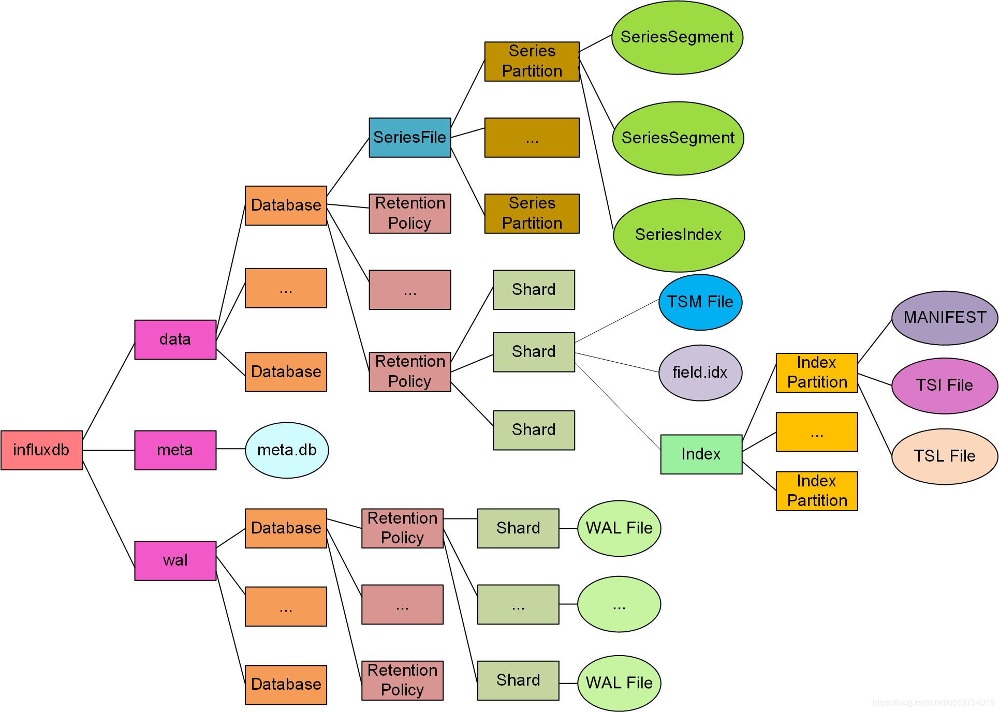

## Day78

### InfluxDB数据存储机制

在InfluxDB中，时序数据支持多值模型，它的一条典型的时间点数据如下所示：


包括：

- measurement：指标对象，也即一个数据源对象。每个measurement可以拥有一个或多个指标值，也即下文所述的**field**。在实际运用中，可以把一个现实中被检测的对象（如：“cpu”）定义为一个measurement
- tags：概念等同于大多数时序数据库中的tags, 通常通过tags可以唯一标示数据源。每个tag的key和value必须都是字符串。
- field：数据源记录的具体指标值。每一种指标被称作一个“field”，指标值就是 “field”对应的“value”
- timestamp：数据的时间戳。在InfluxDB中，理论上时间戳可以精确到 **纳秒**（ns）级别，现在服务器上常用纳秒作为单位

**Serieskey**：InfluxDB中的SeriesKey的概念就是通常在时序数据库领域被称为 **时间线** 的概念, 一个SeriesKey在内存中的表示即为下述字符串(逗号和空格被转义)的 **字节数组**其中，SeriesKey的长度不能超过 65535 字节

**Shard**：在InfluxDB中， 能且只能 对一个Database指定一个 Retention Policy (简称:RP)。通过RP可以对指定的Database中保存的时序数据的留存时间(duration)进行设置。而 Shard 的概念就是由duration衍生而来。一旦一个Database的duration确定后, 那么在该Database的时序数据将会在这个duration范围内进一步按时间进行分片从而时数据分成以一个一个的shard为单位进行保存。

shard分片的时间 与 duration之间的关系如下：

| RP持续时长      | Shard持续时长 |
| --------------- | ------------- |
| <2h             | 1h            |
| >=2h&&<=6months | 1day          |
| >6months        | 7days         |

新建的Database在未显式指定RP的情况下，默认的RP为 **数据的Duration为永久，Shard分片时间为7天**

在InfluxDB中，Field的数据类型在以下范围内必须保持不变，否则写数据时会报错 **类型冲突**。即：

**同一Serieskey + 同一field + 同一shard**

并且Field的数据类型会与插入的第一条数据的对应数据类型保持一致。

### InfluxDB文件结构目录



其中：

- data：存放时序数据和索引文件
- wal：存放插入数据时察省的write ahead log，即wal
- meta：存放元数据

在每个Shard中会有field.idx文件用于存储每个field的数据类型

### 在数据库层面修改field类型可能的方法

服务器上的InfluxDB版本为1.6.2，参考并阅读官方文档，有如下部分解释：


#### 修改查询结果的数据类型

可以看见可以通过<field_key>::<type>的方法转化数字类型的数据类型，如将整数转换为浮点数或者从浮点数转化为整数，具体方法让如下：

```
SELECT_clause <field_key>::<type> FROM_clause
```

使用该种方法将字段值从整数转换为浮点数或者从浮点数转化为整数，官方给出了如下使用案例：

```
> SELECT "water_level"::integer FROM "h2o_feet" LIMIT 4

name: h2o_feet
--------------
time                   water_level
2015-08-18T00:00:00Z   8
2015-08-18T00:00:00Z   2
2015-08-18T00:06:00Z   8
2015-08-18T00:06:00Z   2
```

查询返回water_level浮点字段值的整数查询

**注意**：改方法只能改变查询结果的字段类型，并没有实际改变数据库中对应字段的数据类型，即使用修改后的数据类型插入同样会产生类型冲突

#### 官方给出的直接修改field数据类型方法

对于直接修改字段数据类型的方法，官方给出了如下两种解决方案，但是这两种解决方案无法更新已经写入数据库的数据

- 将新数据类型写入同一series中的不同field

  这种做法会产生一个新的field，并且与原field不共享数据，也就是说**插入新数据的过程中需要同时插入两种不同类型的同一数据**

- 使用Shard System

  Field数据类型允许在不同的shard中不一样，用户可以通过SHOW AHRDS命令查询到end_time来查看当前分片，如果当前时间点在对应分片的end_time之后，则可以插入不同类型的数据，但是这种做法无法改变先前分片上的数据类型，并且在查询时需要处理跨分片的字段类型差异，官方给出的处理方法如下：

  

  加入just_my_type有一个名为my_field的字段，改字段有跨越四个不同分片的四个字段值，每个值都有不同的数据类型(float,int,string,boolean)

  此时使用 SELECT * 仅返回浮点和整数字段值，并且InfluxDB在响应中将整数转化为浮点数，查询结果会是如下：

  ```
  SELECT * FROM just_my_type
  
  name: just_my_type
  ------------------
  time		                	my_field
  2016-06-03T15:45:00Z	  9.87034
  2016-06-03T16:45:00Z	  7
  ```

  可以使用 SELECT <field_key>::<type> [...] 返回所有值类型。此时InfluxDB会在其自己的列中输出每个值类型，并带有递增的列名。查询结果如下:

  ```
  SELECT "my_field"::float,"my_field"::integer,"my_field"::string,"my_field"::boolean FROM just_my_type
  
  name: just_my_type
  ------------------
  time			               my_field	 my_field_1	 my_field_2		 my_field_3
  2016-06-03T15:45:00Z	 		9.87034	  9
  2016-06-03T16:45:00Z	 		7	      7
  2016-06-03T17:45:00Z			                     a string
  2016-06-03T18:45:00Z					                                true
  ```


#### 可能的修改field类型方法

- 导出数据后删除原表并重新导入(**该方法在重新导入数据库的过程中需要保证不能同时有其他的数据插入**)

  - 如果当前Shard已经过期

    在该种情况下，可以直接通过查询获取原数据并删除Measurement，在对数据进行类型转换后重新插入即可，以python为例实现代码如下(需要python版本为3.x，并且安装了InfluxDBClient包)：

    ```python
    def generator_to_list(generator, type):
        rs_list = []
        for data in list(generator):
            rs_list.append(data.get(type))
        return rs_list
    
    
    def change_field(url, port, username, password, dbname, measurement_name):
        client = InfluxDBClient(host=url, port=port, username=username, password=password, database=dbname)
        rs = client.query('select * from ' + measurement_name + ';')  # 显示数据库中的表
        rs_list = list(rs.get_points())
        raw_tags = client.query('show tag keys from ' + measurement_name + ';').get_points()
        raw_fields = client.query('show field keys from ' + measurement_name + ';').get_points()
        tags_list = generator_to_list(raw_tags, 'tagKey')
        fields_list = generator_to_list(raw_fields, 'fieldKey')
        # 使用write_points方法写入,但数据需要处理为json格式
        points = []
        for data in rs_list:
            point = {'measurement': measurement_name, 'time': data.get('time')}
            tags = {}
            fields = {}
            for tag in tags_list:
                tags[tag] = data.get(tag)
            for field in fields_list:
                fields[field] = data.get(field)
    
            # 在这里修改需要更改的field类型
            fields['name'] = str(fields['name'])
    
            point['tags'] = tags
            point['fields'] = fields
    
            points.append(point)
        print(points)
    
        # 删除原有数据库
        client.drop_measurement(measurement_name)
    
        # 重新插入数据
        print(client.write_points(points=points))
    ```

  - 当前Shard未过期

    在该种情况下如果仍然采用上述方法，则同样会引起类型冲突，此时需要按照如下操作：

    - 导出原数据并保存为csv或txt格式，保存命令如下(使用命令行保存)：

      ```
      influx_inspect export [ options ]
      ```

      可选option如下：

      - -compress：压缩输出的标志，默认为false
      - -database<db_name>：要导出的数据库的名称，默认为""
      - -datadir<data_dir>：data目录的路径。默认值为"$HOME/.influxdb/data"
      - -end<timestamp>：时间范围结束的时间戳。时间戳字符串必须采用RFC3339格式
      - -out<export_dir>：导出文件的位置。默认值为"$HOME/.influxdb/export"
      - -retention<rp_name>：要导出的保留策略的名称。默认为""
      - -start<timestamp>：时间范围开始的时间戳。时间戳字符串必须采用RFC3339格式
      - -waldir<wal_dir>：WAL目录的路径。默认值为"$HOME/.influxdb/wal"

    - 对导出的文件进行处理，处理代码以python为例如下(python版本为3.x)：

      ```python
      WINDOWS_LINE_ENDING = b'\r\n'
      UNIX_LINE_ENDING = b'\n'
      
      def influx_csv(file_path, database_name, tags, change_fields):
          raw_file = open(file_path, 'r')
          attributes = raw_file.readline().strip('\n').split(',')
          column = []
          for index in range(len(attributes)):
              column.append(attributes[index])
          datalist = []
          for line in raw_file.readlines():
              line = line.strip().strip('\n')
              data_line = line.split(',')
              datalist.append(data_line)
          change_field_index = []
          tag_index = []
          for tag in tags:
              tag_index.append(column.index(tag))
          for field in change_fields:
              change_field_index.append(column.index(field))
      
          file = open('result.txt', 'w+')
          # 创建数据库，若数据库已有则不需这段代码
          # file.write('# DDL')
          # file.write('\nCREATE DATABASE '+database_name)
          # file.write('\nCREATE RETENTION POLICY oneday ON pirates DURATION 1d REPLICATION 1') 设置保存策略,可不添加
          # file.write('\n\n')
          # 选择数据库
          file.write('# DML')
          file.write('\n# CONTEXT-DATABASE: ' + database_name)
          # file.write('\n# CONTEXT-RETENTION-POLICY: oneday') 设置保存策略,可不添加
          file.write('\n')
      
          for data in datalist:
              line_str = ""
              line_str = line_str + '\n'
              # 表名
              line_str = line_str + data[0] + ','
              # tag
              for index in range(2, len(data)):
                  if index in tag_index:
                      line_str = line_str + attributes[index] + '=' + data[index] + ','
              line_str = line_str[:-1] + " "
              # field
              for index in range(2, len(data)):
                  if index not in tag_index:
                      if index in change_field_index:
                          line_str = line_str + attributes[index] + '=' + data[index] + ','
                      else:
                          line_str = line_str + attributes[index] + '="' + data[index] + '",'
              line_str = line_str[:-1] + " "
              line_str = line_str + data[1]
              file.write(line_str)
          file.write('\n')  # 最后一行数据后需要回车，否则最后一条无法导入
          file.close()
      
          # 由于influxDB读取的txt格式为UNIX格式,所以需要将文件中的换行符进行修改
          with open('result.txt', 'rb') as open_file:
              content = open_file.read()
              open_file.close()
      
          content = content.replace(WINDOWS_LINE_ENDING, UNIX_LINE_ENDING)
          with open('result.txt', 'wb') as open_file:
              open_file.write(content)
              open_file.close()
      
          return True
      ```

    - 对数据库执行删除表操作，命令如下：

      ```
      DROP MEASURMENT <measurement_name>
      ```

    - 关闭InfluxDB，并删除对应保留策略下的fields.idx文件，改文件一般在"$HOME/.influxdb/data/<db_name>/<rp_name>/<rp_id>"目录下

    - 重新启动数据库，并且将处理完的数据文件导入，导入命令如下：

      ```
      influx -import -path=datarrr.txt -precision=ns
      ```

      其中：

      - -path：导入的文件名
      - -precision：时间单位，在服务器数据库中基本为ns

      **注意**：

      - 允许数据库通过使用`-pps`设置导入允许的每秒点数来摄取点。默认情况下，pps 为零并且`influx`不限制导入。

      - 导入处理`.gz`文件，只需包含`-compressed`在命令中。

      - 在数据文件中包含时间戳。InfluxDB 将为没有时间戳的点分配相同的时间戳。这会导致意外的覆盖行为。

      - 如果您的数据文件超过 5,000 个点，则可能需要将该文件拆分为多个文件，以便将您的数据批量写入 InfluxDB。我们建议分批写入 5,000 到 10,000 点。较小的批次和更多的 HTTP 请求将导致次优性能。默认情况下，HTTP 请求会在 5 秒后超时。InfluxDB 仍会在超时后尝试写入点，但不会确认它们已成功写入。

- 使用Flux直接修改field类型(**该方法需要InfluxDB版本为1.7及以上**)

    可以使用如下命令来使用Flux：

  ```
  influx -type=flux
  ```

  Flux提供了如下转换数据类型的方法：

  

  详细用法可以浏览：https://docs.influxdata.com/flux/v0.x/function-types/

  该目录下的Type conversions目录

  #### 解决数据类型冲突的可能方法
  
  如果不限制只在数据库层面修改field类型，只是为了解决类型冲突的话，可以尝试在插入InfluxDB修改对应的数据类型，使其与现有的field类型保持一致，即可成功插入。

